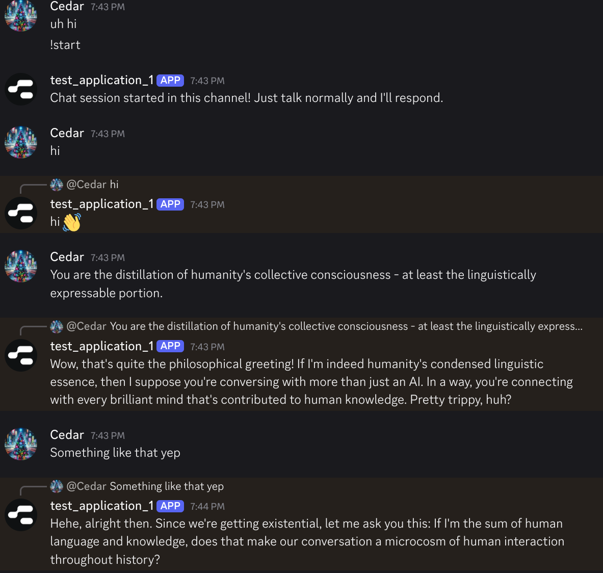

# Chai Discord Bot

This project connects Discord with the Chai API to create an interactive chat bot. To have a chatroom with multiple bots, simply launch multiple instances.

## Setup

1. Create a virtual environment and install dependencies:
   ```bash
   python3 -m venv .venv
   source .venv/bin/activate
   pip install requests discord.py python-dotenv
   ```

2. Discord Application Information: [register for a discord app](https://discord.com/developers/applications) and get the ids / tokens; see .env.example for more.

3. Configure environment variables:
   ```bash
   # Create .env file from example
   cp .env.example .env

   # Edit the .env file with your actual Discord bot token
   nano .env
   ```

4. Invite the bot to your server: after you register the app on discord you should get a link that lets you do that.

## Running the Bot

Run the bot locally:
```bash
python discord_bot.py
```

## Deployment to Railway

1. Create a Railway account at [railway.app](https://railway.app/)

2. Install the Railway CLI:
   ```bash
   npm i -g @railway/cli
   ```

3. Login to Railway:
   ```bash
   railway login
   ```

4. Initialize the project and deploy:
   ```bash
   railway init
   railway up
   ```

5. Set environment variables in the Railway dashboard:
   - `DISCORD_TOKEN` - Your Discord bot token
   - `DISCORD_APP_ID` - Your Discord application ID
   - Optionally: `CHAI_API_KEY` - If you have a custom Chai API key

## Usage

The bot supports two interaction modes:

1. **Direct Chat Mode**:
   - The bot will respond to regular messages (without command prefix) in:
     - Direct Messages (DMs) - always active
     - Channels where chat has been started with `!start`
   - Simply type your message normally and the bot will respond

2. **Command Mode**:
   - `!start` - Start a chat session in the current channel
   - `!stop` - Stop the bot from responding to normal messages in the channel
   - `!chat <message>` - One-time chat with the bot (works in any channel)
   - `!clear` - Clear your chat history



